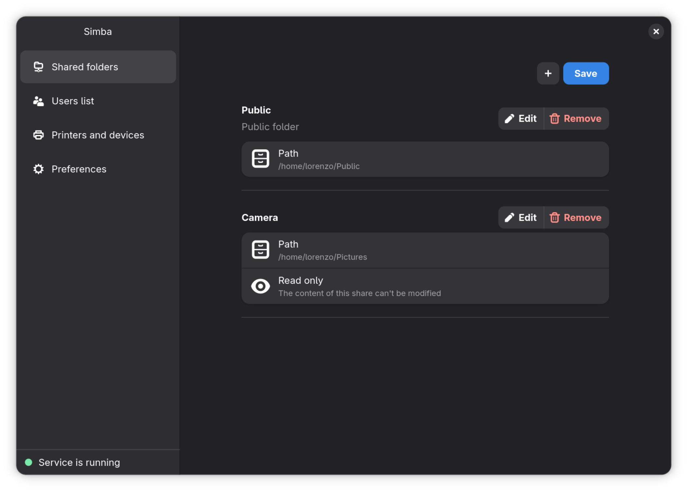

# Simba

<p align="center"></p>

A graphical Samba manager for Linux. Simba lets you manage your local Samba installation without ever touching `smb.conf` manually — share folders, manage users, and configure settings through a clean UI.

> **Note:** Simba manages Samba shares at the system level. It does not interfere with the Samba/network share features built into file managers like Nautilus or Thunar — those operate using Samba's userconfig feature.

<p align="center"></p>

## Installation

### Latest release

Download the latest `.flatpak` bundle from the [Releases page](../../releases/latest).

On many modern distros, you can simply open the file and it should open the app store.

Alternatively, install it with:

```sh
flatpak install simba.flatpak
```

### Flathub

Flathub publication is pending approval. It is not available there yet.

## Build from source

```sh
flatpak-builder --user --install --force-clean build/ it.mijorus.simba.json
flatpak-builder --run build/ it.mijorus.simba.json simba
```
