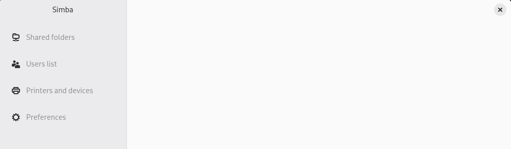

# Simba

<p align="center"></p>


Work in progress SAMBA manager UI for linux.


<p align="center"></p>

## Build and run

```sh
flatpak-builder --user --install --force-clean build/ it.mijorus.simba.json
flatpak-builder --run build/ it.mijorus.simba.json simba
```
